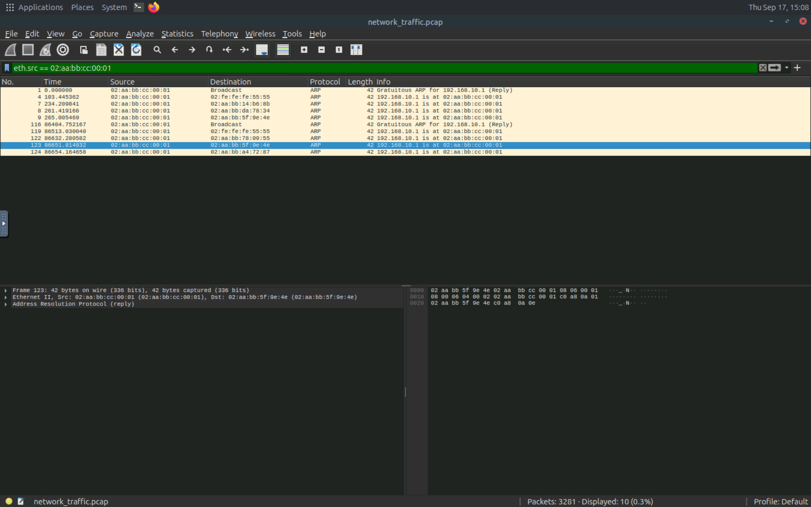
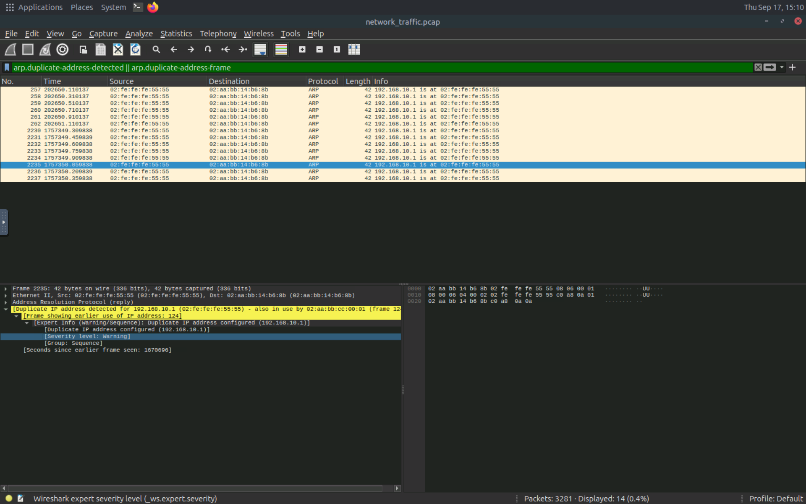

# 🔴 ARP Spoofing Analysis

## 1. Overview

ARP (Address Resolution Protocol) is used in local networks to associate an IP address with a MAC address.

ARP Spoofing is a technique where an attacker sends forged ARP messages to manipulate these associations.

This can allow an attacker to position themselves between two communicating devices.

---

## 2. Lab Objective

The objective of this lab was to understand how ARP Spoofing can affect communication within a local network and how the resulting traffic can be analyzed.

---

## 3. Traffic Analysis

During the practical lab, network traffic was inspected to identify Ethernet and ARP-related communication.

One of the filters used during the analysis was:

```text
eth.src
```

This filter can be used to examine packets based on their Ethernet source address.

---

## 4. Observations

During the analysis, I examined:

* Ethernet source addresses.
* ARP-related traffic.
* Communication between network devices.
* Changes or unusual behavior related to ARP communication.

---

## 5. Security Perspective

Unexpected ARP behavior can be an indicator of suspicious activity on a local network.

A security analyst can investigate unusual IP-to-MAC relationships and unexpected ARP traffic when investigating a potential MITM attack.

---

## 6. Evidence

### Evidence 1 — Ethernet Source Filter

The following screenshot shows the use of the `eth.src` filter during the traffic analysis.



### Evidence 2 — arp.dublicate-address-detected

The following screenshot shows the use of the `eth.src` filter during the traffic analysis.



---

## 7. Key Takeaways

* ARP operates at the local network level.
* ARP does not inherently provide authentication.
* ARP traffic can therefore be abused in MITM scenarios.
* Network traffic analysis can help identify suspicious ARP behavior.

