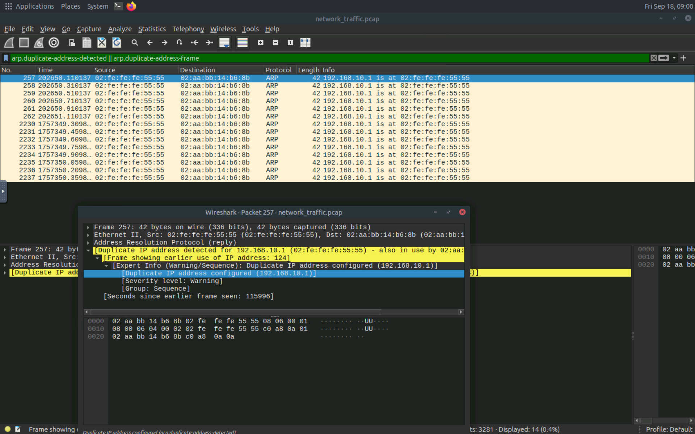

# 🔵 TLS / SSL Traffic Analysis

## 1. Overview

TLS (Transport Layer Security) is used to protect network communication by providing encryption and authentication.

SSL is the predecessor to TLS and is considered obsolete compared with modern TLS versions.

---

## 2. Lab Objective

The objective of this part of the lab was to understand how TLS/SSL affects the visibility of network traffic during a MITM scenario.

---

## 3. Traffic Analysis

During the practical lab, encrypted network traffic was analyzed to understand what information can and cannot normally be observed when communication is protected by TLS.

---

## 4. Observations

The analysis demonstrated the difference between protected and unprotected network communication.

When TLS is properly used, the contents of the application communication are encrypted rather than being transmitted as readable application data.

---

## 5. Security Perspective

Encryption is an important defense against network interception because it helps protect the confidentiality and integrity of communication.

However, certificate validation and proper TLS configuration are also important when investigating potential MITM activity.

---

## 6. Evidence

### Evidence 1 — TLS Traffic

The following screenshot shows TLS-related traffic observed during the controlled lab exercise.

### Evidence 2 — Attacker transfer https into http

The following screenshot shows encrypted network traffic observed during the analysis.

### Evidence 3 — The Proof of MITM Attack

The following screenshot shows encrypted network traffic observed during the analysis.

---

## 7. Key Takeaways

* TLS protects network communication through encryption.
* Modern systems should use TLS rather than obsolete SSL protocols.
* Encrypted traffic changes what a network observer can directly inspect.
* Certificate-related anomalies can be relevant when investigating MITM attacks.
